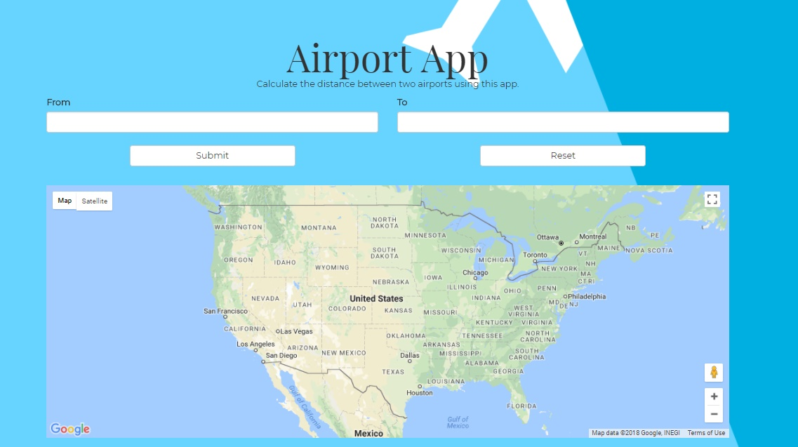

# Airport App



This app calculates the distance between two airports in the United States in nautical miles. Utilizing the Air-Port-Coes API and autocomplete function, the program gets the latitude and longitude of the selected airports, outputs the distance, and plots markers on a Google Map along with a line connecting the two points.

## Installation/Usage
Go to your terminal and enter the following commands.

```
npm install
npm start
```

By default, the program will run on `localhost:3000`

## Technologies Used

* React/Node/NPM
* HTML/CSS
* Air-Port-Codes.com (API and Autocomplete)
* Google Maps API

Libraries

* [React-google-maps](https://github.com/tomchentw/react-google-maps)
* [React Bootstrap](https://react-bootstrap.github.io/)
